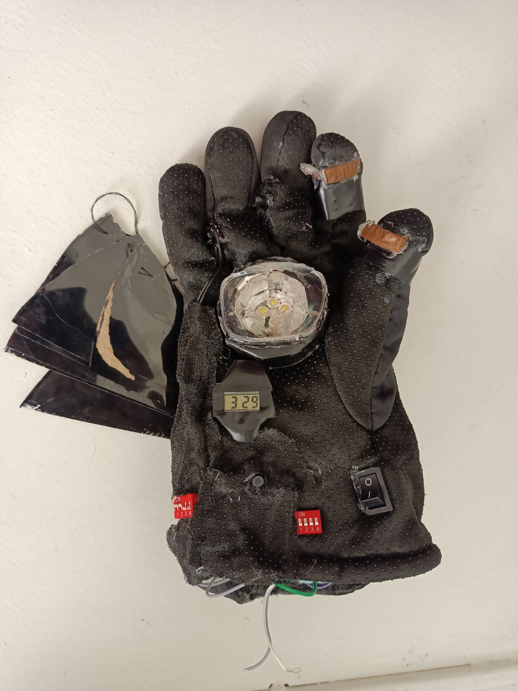

# Special-Forces-Defense-Glove

Special Forces Defense Glove is a multi-functional tactical combat glove system designed for soldiers and special force operations. The glove is specially developed to assist in hand-to-hand combat, enemy distraction, emergency signaling, and self-defense situations. The project combines wearable defense technology with combat-support features in a compact glove-based design.

The system is divided into two gloves: one focused on defense and tactical support, while the other focuses on attack and close-range combat assistance.

The defense glove contains a laser distraction system, induction shock mechanism, RGB signaling lights, a high-intensity white stun light, and a protective shield for close combat defense. These features help soldiers distract enemies, communicate using emergency signals, and protect themselves during dangerous operations.

The attack glove is equipped with retractable claw mechanisms inspired by tactical combat concepts and a pin shooter system mounted near the claws. The claws can be activated using a button placed on the upper side of the glove near the palm area.

![Attack Glove]

Additionally, the glove includes a compact watch module for time management during missions and operations. The entire project is designed as a wearable tactical system for future defense and military technology concepts.

## Features

* Defense Glove:

  * Laser system with multi-hole cap for enemy distraction
  * Induction coil shock system for non-lethal electric shock
  * RGB light system for SOS and tactical signals
  * High-intensity white stun light for temporary enemy disorientation
  * Protective shield for hand-to-hand combat defense
  * Small watch/time display module

* Attack Glove:

  * Wolverine-style retractable claw mechanism
  * Button-triggered claw activation system
  * Pin shooter/web-shooter inspired mechanism
  * Tactical close-range combat support

* Tactical Advantages:

  * Multi-functional wearable combat device
  * Compact and portable design
  * Emergency signaling support
  * Enemy distraction capabilities
  * Self-defense and attack support system

## Components Used

| Component                | Purpose                             |
| ------------------------ | ----------------------------------- |
| Induction Coil           | Generates non-lethal electric shock |
| Laser Module             | Enemy distraction                   |
| Multi-hole Laser Cap     | Creates multiple laser beams        |
| RGB LEDs                 | SOS and tactical signaling          |
| White High-Intensity LED | Enemy stun light                    |
| Protective Shield        | Hand combat defense                 |
| Retractable Claws        | Attack mechanism                    |
| Pin Shooter Mechanism    | Tactical projectile system          |
| Push Buttons             | Activation control                  |
| Battery Pack             | Power supply                        |
| Wires and Connectors     | Electrical connections              |
| Glove Base Structure     | Wearable support system             |
| Mini Watch Module        | Time display                        |

## Working Principle

### Defense Glove

The defense glove operates using a rechargeable power source connected to multiple tactical modules. The laser system projects multiple laser beams using a special cap with several holes to confuse and distract enemies. The induction coil generates a controlled non-lethal shock when activated.

The RGB lighting system can generate different signal colors for emergency communication and SOS signaling. The high-power white light is used to temporarily stun or disorient enemies during close combat situations. The protective shield helps the user block attacks during hand-to-hand combat.

### Attack Glove

The attack glove contains retractable claws connected to a trigger button mechanism. When the button placed on the upper palm side is pressed, the claws extend outward for combat support. The pin shooter mechanism mounted after the claw section provides an additional tactical feature inspired by web-shooter concepts.

## Applications

* Military operations
* Special force missions
* Tactical combat training
* Emergency defense systems
* Future wearable defense technology research
* Soldier assistance systems

## Advantages

* Compact wearable system
* Multi-purpose tactical features
* Combines defense and attack functions
* Useful in close-range combat situations
* Portable and easy to carry
* Supports emergency signaling

## Future Improvements

* AI-based targeting system
* Voice command activation
* GPS tracking integration
* Bluetooth communication system
* Lightweight advanced materials
* Rechargeable fast-charging battery system
* Biometric safety lock

## Disclaimer

This project is developed for educational, research, and innovation purposes only. The system is a conceptual defense technology prototype and should be handled carefully and responsibly.

## Authors

Developed by the Special Forces Defense Glove Team.
